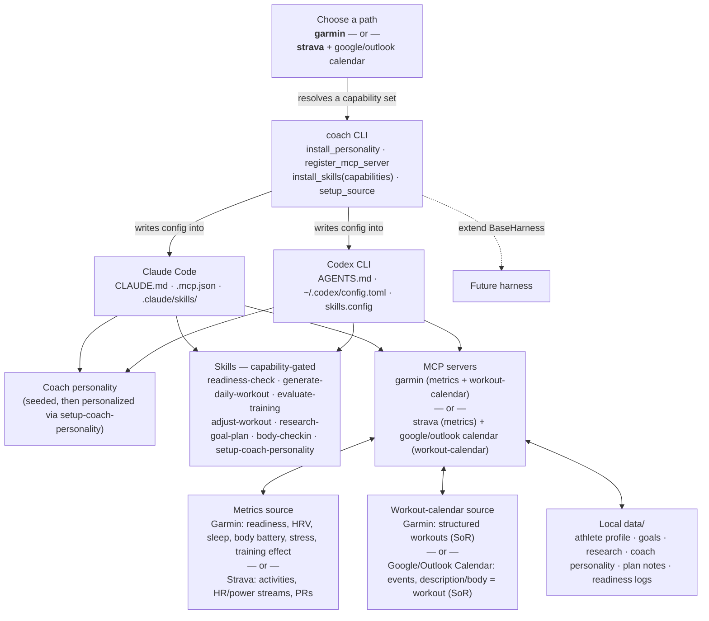

# Architecture & principles

Coach AI is a **definition** — a personality, a set of skills, and a connection to your fitness data — that runs
*inside* agent harnesses you already use (Claude Code, Codex CLI, and more), instead of a standalone program you run
and maintain.

There is no long-running "Coach AI process." At runtime there is just Claude Code or Codex, configured with a
personality, skills, and an MCP connection to your data. The `coach` CLI is a one-time (or re-run-when-needed)
configurator.

## Five design principles

!!! abstract "1. Intelligence lives in the agent, not in Python"
    Python code in this repo *fetches, normalizes, and stores* data. It never computes a fitness score, a
    "should I train today" verdict, or a workout-quality grade. Athletes, sports, and goals vary too widely for
    fixed formulas — the agent reasons over normalized data and the athlete's stated goals every time.

!!! abstract "2. Sources are the system-of-record for workouts"
    Scheduled workouts live on the active workout-calendar source; completed activities, execution scores, and
    training effect come from the active metrics source's activity data. Coach AI never keeps a second,
    possibly-stale copy of "did I do the workout."

!!! abstract "3. Author skills once, install everywhere"
    Claude Code and Codex CLI both understand the `SKILL.md` folder format. Every coaching workflow — readiness
    check, daily workout generation, training evaluation, plan adjustment — is written once in `skills/` and
    installed into whichever harness(es) the user has.

!!! abstract "4. Setup should be three commands"
    Authenticate a data source, run `coach setup --source <name>`, run `coach install --harness claude|codex|all`.
    Everything else — MCP config, personality files, skill directories, and permissions (including native
    `WebSearch`/`WebFetch`/`Bash` for research) — is generated.

!!! abstract "5. Sources are pluggable and capability-aware"
    A `SourceSpec` registry describes how to launch, authenticate, and scope each data provider's MCP server, and
    what *capabilities* (HRV, readiness, sleep, structured workouts, …) it contributes. Milestone 1 ships **two
    functional paths**: **Garmin** (one source, full capability set) and **Strava + Google/Outlook Calendar** (split
    metrics/calendar roles, reduced capability set). The installer only enables skills — and tailors their tools —
    to what the chosen path actually supports; nothing is faked. See
    [Capabilities & paths](capabilities.md) for the full model.

## High-level architecture



### Request & data flow, narrated

1. On first install, the athlete picks a **path** — `garmin`, or `strava` + a calendar source. The `coach` CLI
   resolves the path into a **capability set** (see [Capabilities & paths](capabilities.md)) that gates and tailors
   which skills get installed.
2. The athlete talks to their agent (Claude Code or Codex), either interactively or via the local scheduled
   task/automation that fires the daily loop.
3. The agent's `CLAUDE.md`/`AGENTS.md` carries the coach personality — tone, coaching philosophy, and pointers to the
   skills and data layout. The personality itself was produced by `setup-coach-personality` from the athlete's goals
   and the active path's data.
4. Based on the request (or the scheduled routine), the agent invokes a `SKILL.md` skill — e.g. `readiness-check` or
   `generate-daily-workout` — using whichever tools the active path installed for that skill.
5. The skill instructs the agent to call MCP tools directly against the active metrics source (read training
   readiness/HRV/recent activities, or Strava activities/streams) and/or run small Python helpers
   (`coach/analysis/assemble.py`, `coach/storage/store.py`) to normalize and persist data under `data/`.
6. The agent reasons over the normalized payload plus the athlete's goals (from `data/goals/`) and produces coaching
   output — a recommendation, a new workout, written feedback.
7. Where the result is a workout, the agent writes it to the **active workout-calendar source** — Garmin
   (`create_*` + `schedule_workout`/`schedule_week`) or a Google/Outlook Calendar event (`create-event`) — and
   records a thin `plan/<date>.json` note locally for context continuity.

### Why this is "harness-native"

Nothing above requires a long-running Coach AI process, a custom UI, or a custom agent loop. The "application" is: a
markdown personality file, a handful of `SKILL.md` folders, an MCP server registration, and a `data/` directory.
Anything that can read those — today Claude Code and Codex CLI, tomorrow possibly other harnesses — becomes Coach AI.

## The harness installer — `BaseHarness`

A small Python ABC defines the contract every agent harness must satisfy. Two concrete implementations ship in
Milestone 1: `ClaudeHarness` and `CodexHarness`. Adding a third harness later means writing one new subclass — no
change to skills, sources, or storage.

```python title="coach/harness/base.py"
class BaseHarness(ABC):
    """Contract for installing Coach AI into an agent harness."""

    def install_personality(self, text: str) -> Path:
        """Write/merge the coach personality into the harness's instructions file."""

    def register_mcp_server(self, spec: SourceSpec) -> Path:
        """Add an MCP server entry (command, args, env, enabled tools) for `spec`."""

    def install_skills(self, skills_dir: Path, capabilities: set[str]) -> list[Path]:
        """Install skills whose required capabilities ⊆ `capabilities`; render each
        SKILL.md's tool list/procedure for the active path before copying."""

    def setup_source(self, spec: SourceSpec) -> None:
        """Run auth + register_mcp_server for a data source end-to-end."""

    def verify(self) -> dict[str, bool]:
        """Sanity-check that files exist and are well-formed; returns a status map."""
```

!!! tip "Capability-aware install"
    `install_skills()` receives the **union of capabilities** from every source in the active path. Each `SKILL.md`
    is authored with capability-tagged sections and `{{tool: capability_name}}` placeholders; the installer (a) drops
    skills whose *required* capabilities aren't met, and (b) resolves placeholders to the concrete tool for the
    active path (e.g. `{{tool: structured_workout_create}}` → `create_strength_workout` on Garmin, or `create-event`
    on Google Calendar). The rendered `SKILL.md` the agent sees only ever references tools that actually exist for
    the installed sources.

### File-target matrix

| Method | ClaudeHarness writes | CodexHarness writes |
|---|---|---|
| `install_personality()` | `./CLAUDE.md` (merged, marked section) | `./AGENTS.md` (merged, marked section) |
| `register_mcp_server()` | `./.mcp.json` → `mcpServers.<name>` (stdio: command/args/env) | `~/.codex/config.toml` → `[mcp_servers.<name>]` |
| `install_skills()` | `./.claude/skills/<skill>/SKILL.md` | `~/.codex/config.toml` → `skills.config.<n>.path` + `.enabled = true` |
| `setup_source()` | runs source auth, then `register_mcp_server()` | same |
| `verify()` | also writes `./.claude/settings.json` → `enableAllProjectMcpServers: true` + grants `data/` read/write | checks `config.toml` sections parse and skill paths exist |

Both implementations **merge** rather than overwrite — the personality block and MCP entries are wrapped in
`<!-- coach:start -->` / `<!-- coach:end -->` markers (or TOML table keys) so re-running `coach install` is
idempotent and preserves any other content the user has in `CLAUDE.md`/`AGENTS.md`/`config.toml`.
