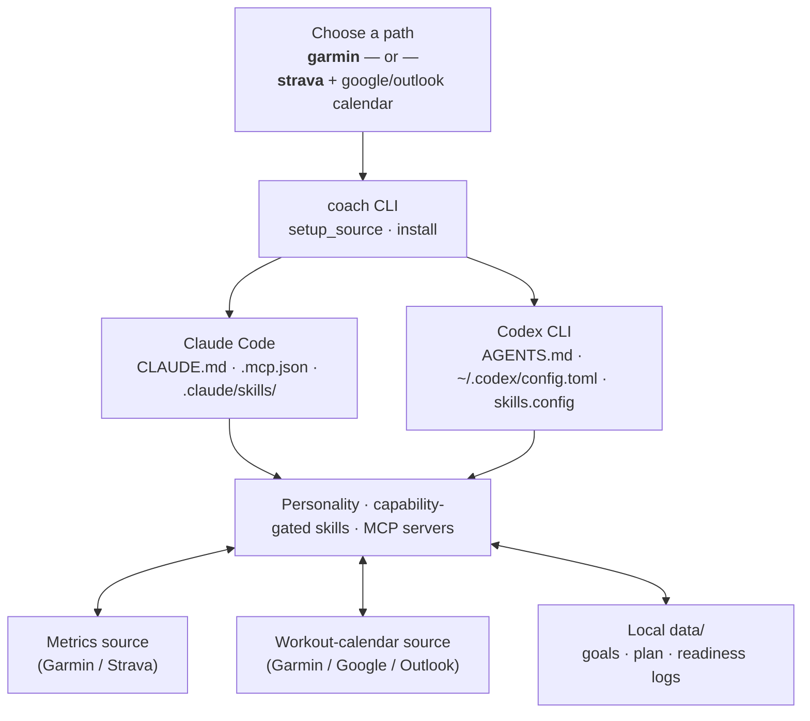

# Coach AI

**Your coach, wherever your agent lives.**

Coach AI is not an app you run — it's a **portable coaching agent definition** that installs *into* agent
harnesses you already use ([Claude Code](https://docs.claude.com/en/docs/claude-code) and
[Codex CLI](https://github.com/openai/codex)). A small `coach` CLI configures a coach **personality**, a set of
**skills** (`SKILL.md` files), and live **MCP** connections to your fitness data. The harness's own reasoning,
memory, and scheduling (`/loop`, `/schedule`) do the rest.

[Get started :material-arrow-right:](installation.md){ .md-button .md-button--primary }
[Browse skills](skills.md){ .md-button }

---

## How it works

There is no long-running "Coach AI process". At runtime there is just Claude Code or Codex CLI, configured with:

1. A **personality** — coaching tone & philosophy, written into `CLAUDE.md` / `AGENTS.md`.
2. **Skills** — step-by-step `SKILL.md` procedures for readiness checks, workout generation, training evaluation,
   plan adjustments, goal research, and personality setup.
3. **MCP servers** — live connections to your fitness data (Garmin, Strava, Google/Outlook Calendar).
4. A local `data/` directory — goals, research notes, a thin daily plan, readiness logs, and the rendered coach
   personality. **Nothing duplicates your workout history** — your metrics source / calendar is the system of
   record.

!!! tip "Core principle: intelligence lives in the agent, not in Python"
    The Python in this repo only fetches, normalizes, and persists data (`coach/analysis/assemble.py`,
    `coach/storage/store.py`) — it never computes a fitness score or a "should I train today" verdict. That
    judgment is the agent's, every time, informed by your goals and the normalized data. See
    [Architecture & principles](concepts/architecture.md) for the full reasoning.

---

## Supported paths & capabilities

Coach AI ships **two functional paths**. A path = one **metrics** source + one **workout-calendar** source (Garmin
covers both). The installer resolves the union of your configured sources' capabilities and uses it to gate and
tailor every skill — nothing is faked when a capability is missing.

| Source | Status | Role(s) | Capabilities |
|---|---|---|---|
| `garmin` | :material-check-circle: functional | metrics + workout_calendar | `readiness`, `hrv`, `sleep`, `body_battery`, `stress`, `training_load`, `vo2max`, `training_effect`, `structured_workouts` |
| `strava` | :material-check-circle: functional | metrics (read-only) | `activity_streams`, `prs`, `training_load` |
| `google_calendar` | :material-check-circle: functional | workout_calendar | `free_text_workouts` |
| `outlook_calendar` | :material-check-circle: functional | workout_calendar | `free_text_workouts` |
| `apple_health` / `whoop` | :material-progress-wrench: scaffold | metrics | *future — no MCP yet* |

**The two paths are not equal**, and the coach says so up front:

- **Garmin** — full readiness/HRV/sleep/body-battery/training-load data, plus **structured workouts** pushed to the
  Garmin calendar and rescheduled in place.
- **Strava + Google/Outlook Calendar** — Strava supplies activity streams and PRs; the calendar is the workout
  system-of-record, with each session written as a **free-text event** (`description`/`body`). No readiness/HRV/
  sleep/body-battery — those steps are skipped, not faked.

See [Capabilities & paths](concepts/capabilities.md) for the full capability matrix.

---

## Where to go next

-   :material-rocket-launch:{ .lg .middle } **Installation**

    ---

    Authenticate a source, run `coach setup`, install into your harness, and set up the daily loop.

    [:octicons-arrow-right-24: Installation guide](installation.md)

-   :material-sitemap:{ .lg .middle } **Architecture & principles**

    ---

    The five design principles, the high-level architecture, and the harness installer contract.

    [:octicons-arrow-right-24: Concepts](concepts/architecture.md)

-   :material-clipboard-list:{ .lg .middle } **Skills catalog**

    ---

    What each skill does, when it runs, and how it behaves on each path.

    [:octicons-arrow-right-24: Skills](skills.md)

-   :material-calendar-sync:{ .lg .middle } **Daily workflow**

    ---

    Onboarding, the daily loop, and annotated example conversations.

    [:octicons-arrow-right-24: Daily workflow](workflow.md)

