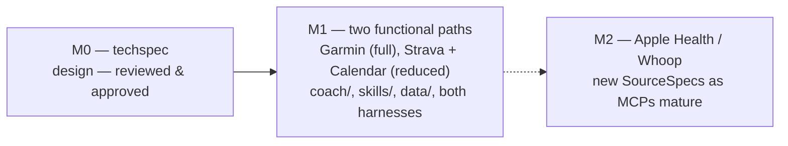

# Roadmap & milestones

## Milestone 1 — Garmin + Strava/Calendar end-to-end

1. `coach/storage/schema.py` + `store.py`, with round-trip tests (incl. optional `metrics_snapshot`,
   `workout_ref`/`workout_source`).
2. `coach/sources/{base,registry,garmin,strava,google_calendar,outlook_calendar}.py` with verified `SourceSpec`s —
   `roles`, `capabilities`, and the shared capabilities vocabulary constant.
3. `coach/harness/{base,claude,codex}.py` + `coach/cli.py`, with **capability-aware**
   `install_skills(skills_dir, capabilities)` and `{{tool: ...}}` templating.
4. `coach/scheduling.py` (`parse_time_of_day`, `to_cron`, and the three local-only writers), wired into
   `coach setup --schedule`/`--schedule-time`.
5. The seven `skills/*/SKILL.md` files per the [skills catalog](skills.md), including `setup-coach-personality`.
6. `coach/prompts/coach_personality.md` seeded (stripped of ReAct scaffolding); `setup-coach-personality`
   personalizes it into `data/coach/personality.{md,json}` on confirmation.
7. Removal of `main.py`, `workout_db_server.py`, TinyDB and Tavily deps; Strava assets moved under `strava/` as the
   now-functional Strava metrics source.
8. Full verification checklist run on **both paths** (Garmin, and Strava + Google/Outlook Calendar) and both
   harnesses (Claude Code, Codex CLI).

## Milestone 2+ — additional sources

Apple Health and Whoop remain placeholders until a suitable MCP server exists or is built — the `SourceSpec` shape
(including `roles` and `capabilities`) won't need to change; each new source simply declares which capabilities it
adds and which role(s) it fills. Outlook Calendar ships alongside Google Calendar in M1 as the second
workout-calendar binding rather than being deferred, since the [event-as-workout abstraction](sources/strava-calendar.md)
is the same shape for both.

## Risks & mitigations

| Risk | Impact | Mitigation |
|---|---|---|
| Garmin OAuth token expires (~6 months) | MCP calls start failing silently | `coach` docs the re-auth command; `verify()` / `coach setup --source garmin` can detect and prompt for re-auth. |
| Structured-workout limits (exercise catalog mismatches) | Unusual exercise names render as generic "Other" steps in Garmin Connect | Acceptable for M1 — original name is preserved in `exerciseName`; revisit if it hurts UX. |
| Harness trust / permission prompts (MCP servers, web tools, file writes) | First-run friction; athlete may decline a prompt | `coach install` pre-configures `.claude/settings.json` permissions (incl. `WebSearch`/`WebFetch`/`Bash`) and documents the one-time `/mcp` trust prompt. |
| Personality/skill drift between Claude and Codex installs | Inconsistent coaching experience across harnesses | Single source of truth (`coach/prompts/coach_personality.md`, `skills/`) — both harnesses install from the same files via `BaseHarness`. |
| Google Calendar MCP in OAuth "testing" mode — refresh tokens expire after 7 days | Google Calendar path silently stops working a week after setup, athlete must re-auth | Documented 7-day testing limit; recommend publishing the OAuth consent screen (or moving to internal/production status) for personal long-term use; `verify()` can detect an expired token and prompt re-auth. |
| Outlook Calendar requires an Azure app registration with `Calendars.ReadWrite` | Higher setup friction than Google Calendar for the second workout-calendar binding | Position Outlook as the secondary binding (Google is the lead); app-registration steps documented once; MSAL device-code flow keeps the per-user setup to a single browser sign-in. |
| Calendar workouts are free text (description/body), not structured data | Agent-written sessions could drift into inconsistent formats, making them hard to re-read on `adjust-workout` or `evaluate-training` | `generate-daily-workout` and `adjust-workout` write the description in a fixed lightweight template; the agent re-parses its own template on read — no external schema needed. |
| Athletes on the Strava + Calendar path may not realize what they're missing vs. Garmin | Confusion when `readiness-check` is subjective-only or `generate-daily-workout` can't reason from training load/HRV | Onboarding has the coach state the active path's capability set up front; the [skill catalog](skills.md)'s Full/Degraded/Unavailable badges make the gap explicit and discoverable at install time. |
| Local-only daily loop is skipped while the machine is asleep or the app is closed | Athlete misses a morning readiness-check/workout-generation run | Accepted trade-off for keeping source credentials local; onboarding states this plainly, and a missed run is simply picked up the next time the machine/app is awake — no remote/cloud scheduling mode in M1. |
