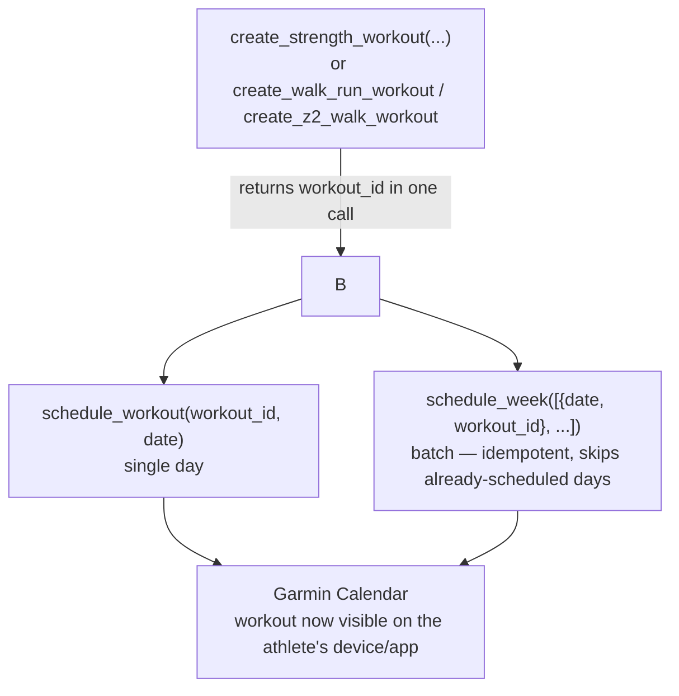

# Garmin

Coach AI uses [`Taxuspt/garmin_mcp`](https://github.com/Taxuspt/garmin_mcp) (MIT license, Python, built on
`garminconnect`/`garth`, stdio transport). It exposes 110+ tools; Coach AI enables a curated ~16-tool allowlist via
`GARMIN_ENABLED_TOOLS`. Everything below was verified by reading the actual source
(`workout_builders.py`, `workouts.py`), not just the README.

Garmin is the only source that covers **both** the `metrics` and `workout_calendar` roles — see
[Capabilities & paths](../concepts/capabilities.md) for how this compares to the Strava + Calendar path.

## Enabled tool allowlist

### Read tools

| Tool | Returns |
|---|---|
| `get_training_readiness` | Today's readiness score + contributing factors |
| `get_morning_training_readiness` | Morning-specific readiness snapshot |
| `get_hrv_data` | HRV status & trend |
| `get_sleep_data` | Sleep score, stages, duration |
| `get_body_battery` | Energy reserve curve for the day |
| `get_stress_summary` | Daily stress summary |
| `get_steps_data` | Step count / activity minutes |
| `get_activities` | Recent activity list (curated summary) |
| `get_activity` | Single activity detail incl. training effect / execution |
| `get_training_status` | Current training status label (e.g. productive, overreaching) |
| `get_training_load_trend` | Acute/chronic load trend |
| `get_vo2max_trend` | VO2max trend over time |
| `get_stats` | Daily summary stats |

### Write tools

| Tool | Returns |
|---|---|
| `create_walk_run_workout` | `{status, workout_id, name, message}` |
| `create_z2_walk_workout` | `{status, workout_id, name, message}` |
| `create_strength_workout` | `{status, workout_id, name, message}` — **deprecated for our use; see below** |
| `upload_workout` | `{status, workout_id, name, message}` — raw full-JSON upload, used for strength |
| `schedule_workout` | Confirmation of calendar placement |
| `schedule_week` | Batch-schedules a week, idempotent |
| `get_workouts` | List of saved workout definitions |
| `get_scheduled_workouts` | Calendar entries in a date range |
| `unschedule_workout` | Removes a calendar entry |

This allowlist is ~15% of the 110+ tools the server exposes — set via
`GARMIN_ENABLED_TOOLS=get_training_readiness,get_morning_training_readiness,...` in the MCP server's `env` (see
[Installation](../installation.md)). The complementary `GARMIN_DISABLED_TOOLS` exists for fine-grained exclusions if
a future tool needs to be added back selectively.

## Strength workouts — use `upload_workout`, not `create_strength_workout`

Coach AI builds **strength** workouts through this MCP, but **not** via the `create_strength_workout` convenience
builder. That builder's `build_strength_json` (`workout_builders.py:176`) emits only `exerciseName` on each step and
**never sets `category`** — and Garmin requires *both* `category` and `exerciseName` (FIT enum keys) to classify an
exercise. Without `category`, every exercise type renders as **null** in Garmin Connect. This was verified against a
live upload.

Instead, build the full workout JSON and send it through the raw **`upload_workout`** tool, which accepts a
`category` field. Confirmed from `workouts.py:624` — strength steps require:

- `"category"`: exercise category enum (e.g. `"SQUAT"`, `"LUNGE"`, `"PLANK"`, `"ROW"`, `"CARRY"`, `"DEADLIFT"`)
- `"exerciseName"`: specific variant enum (e.g. `"BARBELL_SQUAT"`, `"WALKING_LUNGE"`, `"FARMERS_WALK"`)
- `"weightValue"` / `"weightUnit"` (optional): prescribed load

```python
upload_workout(workout_data={
  "workoutName": "Hyrox Station — Pull, Carry & Core",
  "sportType": {"sportTypeId": 5, "sportTypeKey": "strength_training"},
  "workoutSegments": [{
    "segmentOrder": 1,
    "sportType": {"sportTypeId": 5, "sportTypeKey": "strength_training"},
    "workoutSteps": [
      {"type": "ExecutableStepDTO", "stepOrder": 1,
       "stepType": {"stepTypeId": 3, "stepTypeKey": "interval"},
       "endCondition": {"conditionTypeId": 10, "conditionTypeKey": "reps"},
       "endConditionValue": 10.0,
       "targetType": {"workoutTargetTypeId": 1, "workoutTargetTypeKey": "no.target"},
       "category": "LUNGE", "exerciseName": "WALKING_LUNGE"},
      # ...rest step (stepTypeId 5) + one interval step per exercise...
    ]
  }]
})
```

The exact `category` + `exerciseName` pairs for our common Hyrox and strength moves live in the **Garmin Strength
Exercise Catalog** section of `generate-daily-workout/SKILL.md`. `create_walk_run_workout` and
`create_z2_walk_workout` still cover running/cardio fine — the builder problem is specific to strength.

> **Setup dependency:** `upload_workout` must be listed in `GARMIN_ENABLED_TOOLS` in `.mcp.json`, and the MCP server
> must be restarted after adding it (the allowlist is read only at server startup).

See the **Garmin Strength Exercise Catalog** section in `generate-daily-workout/SKILL.md` for the key→name mapping
table covering common Hyrox exercises. For the full Garmin FIT catalog, consult the garmin_mcp resource
`workout://reference/structure` (via `ReadMcpResourceTool`) or the Garmin FIT SDK profile docs at
https://developer.garmin.com/fit/protocol/.

## Create → schedule flow



## Token efficiency

- **Curated responses** — builder tools return a small JSON object (`status`, `workout_id`, `name`, `message`), not
  the full Garmin workout JSON.
- **One call per workout** — `create_*` both builds *and* uploads; no separate "save" then "upload" round trip.
- **Batch scheduling** — `schedule_week` places up to 7 days in one call and is idempotent (checks
  `_is_already_scheduled` before writing), so re-running `generate-daily-workout` for a week doesn't create
  duplicates or waste calls.
- **Tool allowlist** — restricting to ~16 of 110+ tools via `GARMIN_ENABLED_TOOLS` keeps the tool-definitions block
  the agent sees small, reducing prompt overhead on every turn.
- **Read tools are pre-summarized** — `get_activities`, `get_scheduled_workouts`, etc. return curated summaries
  rather than raw Garmin API payloads.
