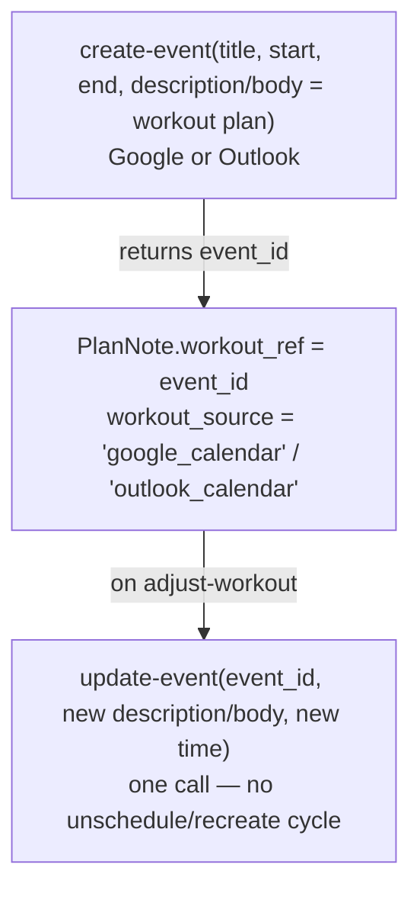

# Strava + Calendar

The second functional path pairs a **read-only Strava metrics source** with a **calendar as the workout-calendar
source** (Google Calendar is the lead binding; Outlook Calendar is a second, equivalent binding). See
[Capabilities & paths](../concepts/capabilities.md) for the full capability comparison — `garmin` covers nine of
twelve capabilities, this path covers three (`activity_streams`, `prs`, `free_text_workouts`) plus a derived
`training_load`. Below are the concrete tool inventories and auth steps for each binding.

## Strava (metrics) — read-only

Reuses the repo's existing `strava_server.py` / `strava_client.py` (or the community
[`r-huijts/strava-mcp`](https://github.com/r-huijts/strava-mcp), TS/stdio) behind a curated allowlist, the same
pattern as Garmin's `GARMIN_ENABLED_TOOLS`:

| Tool | Returns |
|---|---|
| `get-activities` | Recent activity list (curated summary — type, duration, distance, avg HR/pace/power) |
| `get-activity-streams` | Time-series HR / power / pace / cadence for a single activity |
| `get-athlete-stats` | Rolling totals (recent/YTD/all-time distance, elevation, ride/run counts) |
| `get-segment-prs` | Personal-record efforts on starred/visited segments |
| `get-athlete-zones` | HR and power zone boundaries, used to bucket streams without a training-effect score |

!!! warning "Read-only by design"
    Strava's API has no endpoint for planned or structured workouts — there is nothing to write. This is why
    `strava` only ever carries the `metrics` role, not `workout_calendar`. A calendar source supplies
    `workout_calendar`. Auth reuses `scripts/setup_auth.py`'s existing OAuth flow.

## Google Calendar (workout-calendar) — lead binding

Uses [`nspady/google-calendar-mcp`](https://github.com/nspady/google-calendar-mcp) (TS/stdio). A workout **is** a
calendar event; the session plan (warm-up, intervals, target paces/HR, notes) lives in the event's free-text
`description`.

| Tool | Use in Coach AI |
|---|---|
| `list-events` | Find today's/this week's workout events (= `get_scheduled_workouts` equivalent) |
| `get-event` | Read a single event's `description` for the planned session |
| `create-event` | Write a new workout — title + `description` holds the structured plan (= `create_* → schedule_workout` equivalent) |
| `update-event` | **Modify in place** — rewrite `description`/time for `adjust-workout` (= Garmin `unschedule_workout` → recreate → reschedule, but one call) |
| `delete-event` | Remove a workout event (rarely used — `update-event` is preferred for adjustments) |

**Auth:** desktop OAuth via a `gcp-oauth.keys.json` credentials file (Google Cloud Console → OAuth client, "Desktop
app" type); the MCP server runs a local browser-based consent flow once and caches the refresh token.

!!! warning "Google OAuth 'testing' mode"
    While the OAuth consent screen is in "testing" status, refresh tokens expire after **7 days**, silently breaking
    the calendar connection until you re-auth. For personal long-term use, publish the consent screen (or move it to
    internal/production status) — see [Roadmap](../roadmap.md) for the full risk note.

## Outlook Calendar (workout-calendar) — second binding

Uses [`softeria/ms-365-mcp-server`](https://github.com/softeria/ms-365-mcp-server) (TS/stdio) with the same
event-as-workout model — the session plan lives in the event's `body` field.

| Tool | Use in Coach AI |
|---|---|
| `list-events` | Find today's/this week's workout events |
| `get-event` | Read a single event's `body` for the planned session |
| `create-event` | Write a new workout — title + `body` holds the structured plan |
| `update-event` | **Modify in place** (PATCH) — rewrite `body`/time for `adjust-workout` |

**Auth:** MSAL device-code flow against an Azure app registration with the `Calendars.ReadWrite` delegated scope —
more setup overhead than Google's (an Azure tenant app registration is required).

## Workout = calendar event, modify = update-event

This is simpler than the Garmin modify path (`unschedule_workout` → `create_*` → `schedule_workout`) precisely
because a calendar event is a single mutable object — but it puts more weight on the agent to keep the
`description`/`body` text well-structured, since there's no builder schema enforcing it.
`generate-daily-workout` and `adjust-workout` write the description in a fixed lightweight template, and the agent
re-parses its own template on read — no external schema needed.
