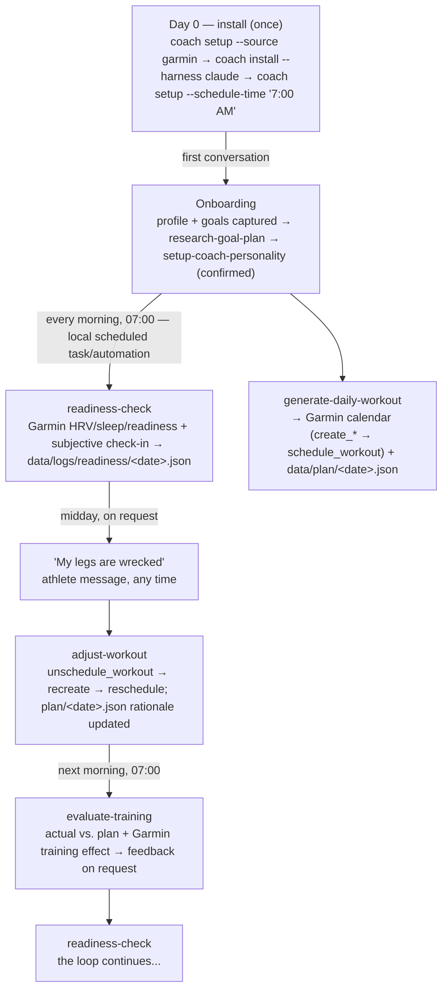
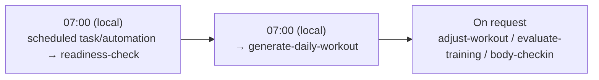

# Daily workflow

This page walks through what using Coach AI actually looks like — from the first conversation to the daily loop, on
both functional paths.

## End-to-end example: a week with Coach AI (Garmin path)

`data/` and the active sources are the only state — every box reads/writes through them.

On the Strava + Calendar path, the same week runs with the same shape: the 07:00 local loop still fires
`readiness-check` (subjective-only) and `generate-daily-workout` (free-text calendar event), `adjust-workout` still
rewrites the event in place via `update-event`, and `evaluate-training` reasons from HR/pace streams instead of
Garmin's training effect. Nothing about the loop's *shape* changes — only which tools and data each box has
available (see [Capabilities & paths](concepts/capabilities.md)).

## Onboarding (first run)

1. Athlete picks a **path**: `garmin`, or `strava` + `google_calendar`/`outlook_calendar`.
2. Athlete authenticates the chosen source(s) once — Garmin: `garmin-mcp-auth` (~6-month OAuth cache); Strava: the
   existing `scripts/setup_auth.py` OAuth flow; Google Calendar: desktop OAuth via `gcp-oauth.keys.json`; Outlook
   Calendar: Azure app registration + MSAL device code.
3. Athlete runs `coach setup --source <name>` for each source in the path, then `coach install --harness claude`
   (or `codex`, or `all`) — the installer resolves the path's capability set and installs only the supported,
   capability-tailored skills.
4. Before anything else, the coach **states what the chosen path can and can't do** — see the example below.
5. Athlete opens Claude Code (or Codex) in the project and has a short conversation to seed
   `data/athlete/profile.json` and `data/goals/goals.json` — "I'm training for a sub-22:00 5K by September, lift
   2x/week, no major injuries."
6. Agent runs `research-goal-plan` to write initial research notes and confirm the plan structure with the athlete.
7. Agent runs `setup-coach-personality` — researches coaching strategy, assesses fitness from the active metrics
   source, researches coach tone, then proposes a personality with dials for the athlete to adjust and confirm
   before it's registered into `CLAUDE.md`/`AGENTS.md`.
8. `coach setup --schedule` asks what time to run the daily loop (e.g. "7:00 AM") and writes **local-only**
   scheduling artifacts for whichever harness(es) are installed — a Claude/Cowork scheduled task, a Codex Desktop
   automation, or a launchd/cron fallback. The coach explains up front that this only fires while the machine is
   awake and the relevant app is open — skipped runs simply happen at the next opportunity.
9. Agent mentions that `setup-coach-personality` can be re-run anytime to refine the coach's style, and that the
   daily-loop time can be changed later with `coach setup --schedule-time`.

## Annotated example: path selection & capability disclosure

> **Athlete:** I don't have a Garmin, but I use Strava and Google Calendar.
>
> **Coach:** Got it — I'll set up the Strava + Google Calendar path. Quick heads up on what that means: I won't have
> your HRV, sleep, body battery, or training-readiness data, so morning readiness checks will be subjective-only
> (energy/soreness/mood) plus your recent training load. Workouts go on your Google Calendar as events — the plan
> lives in the event description, and I can move or rewrite them directly when you need to adjust. If you ever
> connect a Garmin, the readiness and structured-workout features unlock automatically. Sound good?
>
> **Athlete:** Yep, that's fine.
>
> *`coach setup --source strava && coach setup --source google_calendar && coach install --harness claude` — installs
> the Strava+Calendar capability-gated skill set.*

## Annotated example: setup-coach-personality (onboarding)

> *`setup-coach-personality` · first run — goals already captured by `research-goal-plan`, proceeding to
> personalization.*
>
> **Coach:** I did some research on training for a sub-22:00 5K — a polarized, mostly-easy intensity distribution
> tends to work well at your level. Your current training status shows "maintaining" with a flat VO2max trend over 8
> weeks, so there's room to build an aerobic base before adding intensity. Here's the coaching style I'd propose:
> autonomy-supportive, recovery-aware, data-informed but plain-language, flexible within a weekly skeleton, and I'll
> lean on questions more than instructions. Want to adjust anything — more push, more recovery focus, more
> structure?
>
> **Athlete:** Push me a bit more on weekends, but keep weekdays low-key — I'm busy on weekdays.
>
> **Coach:** Got it — weekday sessions stay short and easy, weekend long run/tempo gets the bigger push. Here's the
> final summary: [philosophy + dials]. Lock this in?
>
> **Athlete:** Yes, looks good.
>
> *`data/coach/personality.{md,json}` written (`approved: true`); `CLAUDE.md` updated inside
> `<!-- coach:start -->`/`<!-- coach:end -->`. Re-run `setup-coach-personality` anytime to refine.*

## The daily loop

All steps read/write `data/` and the active sources via MCP, on this machine.

The athlete doesn't need to "open an app" at the scheduled time — Claude Code/Cowork's local scheduled task or
Codex's local automation wakes a fresh session at the chosen time, with the same project config
(`.mcp.json`/`CLAUDE.md`/`AGENTS.md`/skills) and this machine's source credentials, runs `readiness-check` then
`generate-daily-workout`, and exits. Because it's local-only, a run is simply skipped if the machine is asleep or the
app isn't open, and picked up next time. Only the skills the active path supports are installed, so the loop is
automatically the right shape for the athlete's sources.

## Annotated example: readiness-check (morning loop)

> */loop · readiness-check — triggered at 07:00, Claude Code wakes, loads `skills/readiness-check/SKILL.md`.*
>
> **Coach:** Pulling your overnight metrics… Training readiness is 58 (moderate), HRV is "unbalanced" today, sleep
> score 61. How are you feeling — energy, soreness, mood?
>
> **Athlete:** Tired, calves a bit sore from yesterday's hills. Mood's fine.
>
> **Coach:** Given the low HRV + sore calves, I'd ease off the planned tempo run today — let's shift to a Z2 recovery
> run or rest, and reassess tomorrow. I've logged this check-in.
>
> *`data/logs/readiness/2026-06-13.json` written with subjective answers, Garmin snapshot, and this recommendation.*

## Annotated example: readiness-check — Strava+Calendar (degraded)

> */loop · readiness-check — triggered at 07:00, no overnight metrics available on this path.*
>
> **Coach:** No overnight metrics on this setup — how's your body feeling this morning? Energy, soreness, mood?
>
> **Athlete:** Bit flat, legs feel okay.
>
> **Coach:** Yesterday was a longer ride (62km), so some flatness tracks. Nothing in your recent load suggests backing
> off further — let's keep today's easy run as planned.
>
> *`data/logs/readiness/2026-06-13.json` written with subjective answers + recommendation; `metrics_snapshot` omitted
> entirely (not zero-filled).*

## Annotated example: adjust-workout — Garmin

> **Athlete:** My legs are wrecked from yesterday — can we move today's tempo run?
>
> **Coach:** Checking today's scheduled workout… you have "Tempo 6x800m" on the calendar. Given yesterday's session
> and this morning's readiness (58, unbalanced HRV), I'll swap today to a 30-min Z2 recovery run and move the tempo
> session to Thursday.
>
> *MCP: `unschedule_workout(sched_4471)` → `create_z2_walk_workout(...)` → `schedule_workout(workout_id,
> "2026-06-13")` → `schedule_workout(tempo_workout_id, "2026-06-18")`*
>
> **Coach:** Done — today's calendar now shows a 30-min easy run, and Thursday has your tempo session. I've noted the
> reason in your plan file.
>
> *`data/plan/2026-06-13.json` updated: `workout_ref` → new `workout_id` (`workout_source: "garmin"`), `rationale`:
> "swapped tempo for recovery run due to leg soreness + low HRV (58)".*

## Annotated example: adjust-workout — Strava+Calendar

> **Athlete:** My legs are wrecked from yesterday — can we move today's tempo run?
>
> **Coach:** Checking your calendar… you have "Tempo 6x800m" today. Given yesterday's session, I'll swap today to a
> 30-min easy run and move the tempo session to Thursday.
>
> *CALENDAR: `update-event(evt_8a91f2, description="30-min easy run, conversational pace", start/end unchanged)` →
> `update-event(evt_a014c7, ..., moved to Thursday)`*
>
> **Coach:** Done — today's calendar event now reads "30-min easy run", and Thursday has your tempo session. I've
> noted the reason in your plan file.
>
> *`data/plan/2026-06-13.json` updated: `workout_ref` unchanged (`"evt_8a91f2"`, `workout_source: "google_calendar"`),
> `rationale`: "swapped tempo for easy run due to leg soreness".*

## Annotated example: evaluate-training (next day)

> **Athlete:** How did yesterday's run go?
>
> **Coach:** Your plan called for 45 min Z2 (HR < 150). Garmin shows 47 min, avg HR 154, aerobic training effect 2.8,
> marked "completed". You ran a touch hot — likely carryover fatigue from Tuesday's strength session. Nothing
> concerning; just keep tomorrow easy and we'll see HR settle back into Z2 by the weekend.

On Strava+Calendar, the same conversation runs on HR/pace alone — "Garmin shows... aerobic training effect 2.8"
becomes "your average HR was 154 for 47 minutes, a bit above your easy-pace zone" — the coaching conclusion is the
same, just reasoned from fewer inputs.
